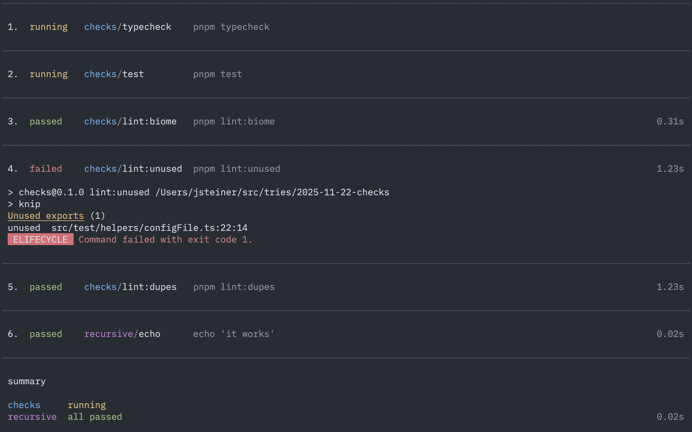

# checks - local CI for humans and agents

Run tests and static analysis in parallel with human friendly, token efficient, output.

To break that down:

* **Parallel**: Parallelize command execution across _one or more_ projects. Great for monorepos.
* **Human friendly**: Clean output, even when running nested suites in parallel. This can be challenging without dedicated tooling.
* **Token efficient**: Only failed checks render output by default. Depending on the verbosity of successful checks, this can save a lot of tokens when run through coding agents. `checks` own suite goes from 3,758 tokens to 153 (though we run a verbose test reporter for esoteric reasons). This can add up after many test runs.



## Installation

npm:

```bash
npm install -D checks-cli
```

pnpm:

```bash
pnpm add -D checks-cli
```

yarn:

```bash
yarn add -D checks-cli
```

## Configuration

`checks` looks for `checks.config.json` in the current working directory. When `--recursive` is set it searches subdirectories recursively, and each project's commands run from the directory where its config file lives.

Example `checks.config.json`:

```jsonc
{
  "$schema": "./node_modules/checks/checks.config.schema.json",
  "project": "web",
  "color": "cyan", // optional
  "checks": [
    { "name": "typecheck", "command": "pnpm typecheck" },
    { "name": "tests", "command": "pnpm test" },
    { "name": "lint", "command": "pnpm lint" }
  ]
}
```

## Usage

Run your suite (current directory only):

```bash
checks
```

Run checks from a different directory:

```bash
checks /path/to/project
```

e.g. run all monorepo checks from a child package:

```bash
checks .. --recursive
```

Run interactively to focus the output of any check (even passing ones):

```bash
checks --interactive
```

Run your suite, including subprojects:

```bash
checks --recursive
```

Fail fast:

```bash
checks --fail-fast
```

Control concurrency (defaults to 75% of available CPUs):

```bash
checks --concurrency 4    # run at most 4 checks in parallel
checks --concurrency Infinity  # does not cap concurrency
```

Filter with `--only`:

```bash
checks --only lint # include only the "lint" check
checks --only "lint*" # include "lint" and "lint:foo", but not "lint:foo:bar"
checks --only "lint:*" # include "lint:foo", but not "lint" or "lint:foo:bar"
checks --only "lint**" # include "lint", "lint:foo", "lint:foo:bar"
checks --only "lint:**" # include "lint:foo" and "lint:foo:bar", but not "lint"
```

Filter with `--exclude` using the same pattern rules as `--only`:

```bash
checks --exclude "lint" # exclude the "lint" check, runs the rest.
```

Filter projects:

```bash
checks --recursive --only "web/**" # include all checks from the "web" project
checks --recursive --only "web/lint" # include only the "lint" check from the "web" project
checks --recursive --only "web*/lint" # use the same pattern rules as above to match project names
```

## CLI options

| Option | Description | Default |
| --- | --- | --- |
| `[directory]` | Base directory to run checks from. Looks for `checks.config.json` in that directory instead of the current directory. | current directory |
| `-i, --interactive` | Keeps the TUI open and enables keyboard controls for focusing specific checks. Non-interactive mode exits as soon as the suite finishes. | off |
| `-f, --fail-fast` | Aborts the remaining checks after the first failure. | off |
| `-r, --recursive` | Search for every `checks.config.json` under the base directory (skipping `node_modules` and `.git`). | off |
| `-c, --concurrency <number>` | Maximum number of checks to run concurrently. Set to `Infinity` for no artificial cap. | 75% of CPUs |
| `-o, --only <pattern...>` | Include only checks matching one or more patterns. Patterns may be `check`, `project/check`, `project/` or `**` and support a trailing `*` for prefix matches. Example: `--only lint --only api/*`. | — |
| `-e, --exclude <pattern...>` | Remove checks matching any pattern (same syntax as `--only`). Overrides `--only` when in conflict. | — |
| `-h, --help` | Show the built-in help. | — |

## Output

- Per check:
  - Status: `running`, `passed`, `failed`, or `aborted`
  - Durations
  - Failed checks always show their captured output
  - In interactive mode you can focus any check to view its log live.

- Exit codes:
  - `0` success
  - `1` orchestrator/config error
  - `2` checks failed
  - `3` aborted (Ctrl+C, `q`, or fail-fast stopping other checks).

## Documentation

* [ARCHITECTURE.md](docs/ARCHITECTURE.md)
